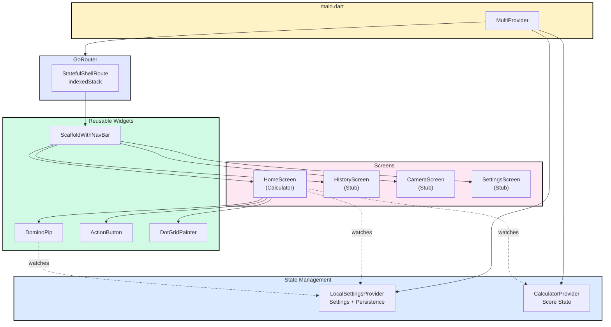
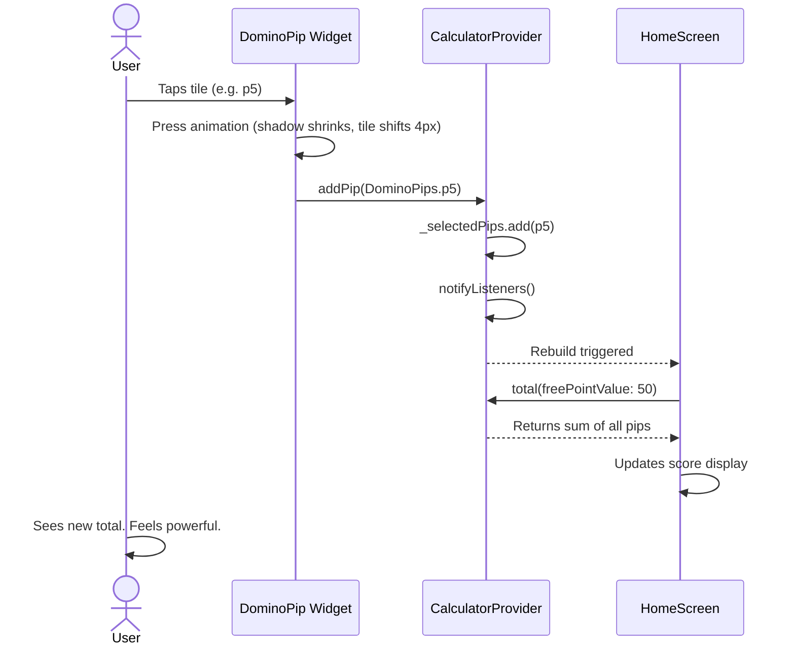
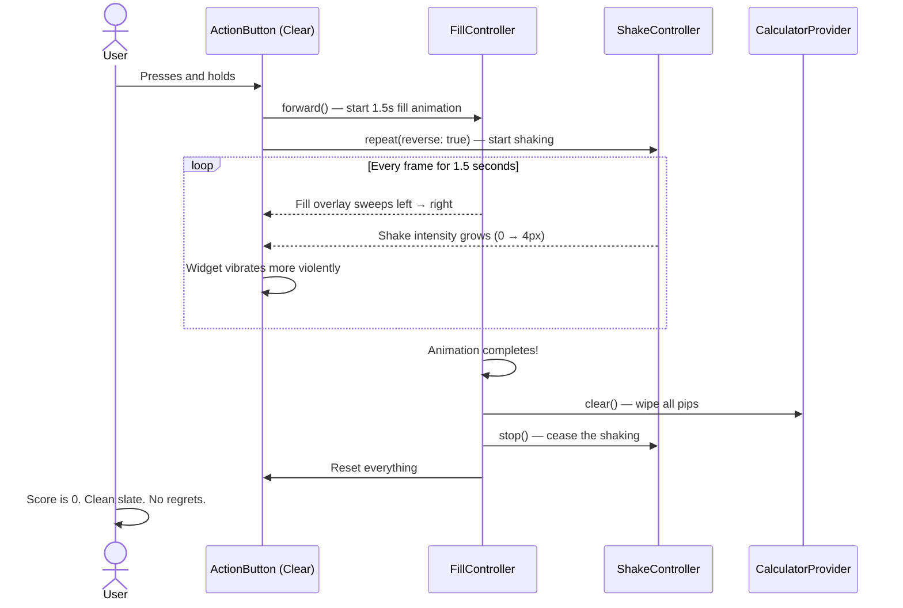
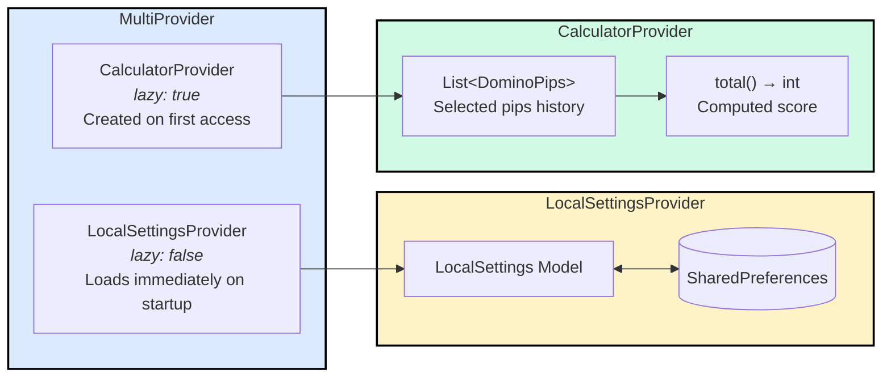
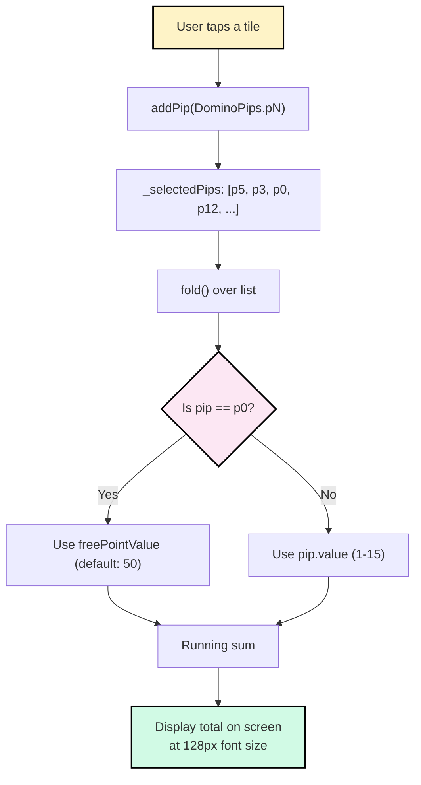
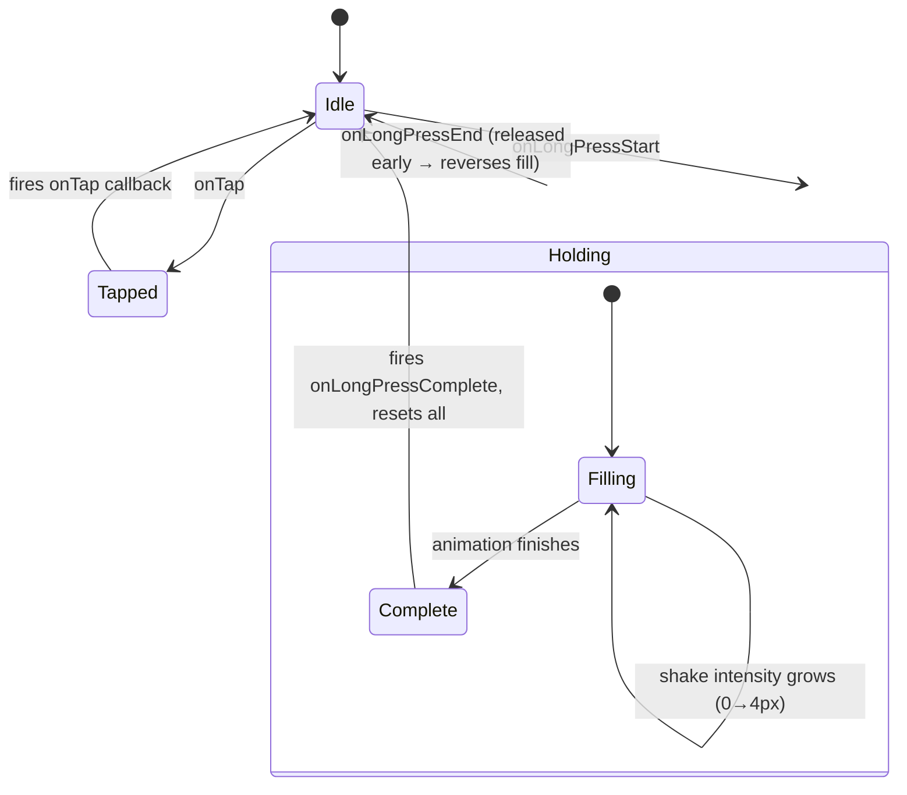
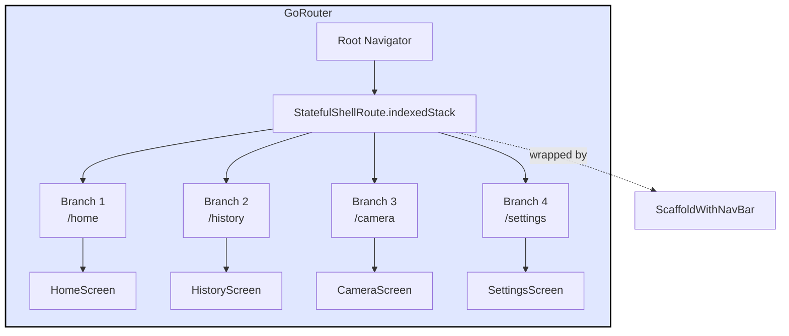

# DOMINO_CALC

### The most brutalist domino score calculator ever built.

> *"Why count pips in your head when your phone can do it with* **style***?"*

A Flutter app for tracking domino scores with a bold, unapologetic **brutalist UI** — hard shadows, sharp corners, no border-radius softness allowed. Supports double-15 domino sets (0–15 pips), configurable blank tile values, and an undo system for when your fat fingers betray you.

Currently on `version-2.0.0` — a ground-up rewrite that takes things from *functional* to *beautiful and functional*.

---

## Table of Contents

- [Features](#features)
- [Screenshots & UI Design](#screenshots--ui-design)
- [Architecture Overview](#architecture-overview)
- [Project Structure](#project-structure)
- [Data Flow](#data-flow)
- [State Management Deep Dive](#state-management-deep-dive)
- [The Scoring Engine](#the-scoring-engine)
- [Widget Breakdown](#widget-breakdown)
- [Routing & Navigation](#routing--navigation)
- [Models & Enums](#models--enums)
- [Assets](#assets)
- [Tech Stack](#tech-stack)
- [Roadmap](#roadmap)
- [Getting Started](#getting-started)
- [Machine Learning](#machine-learning)

---

## Features

- **4x4 Domino Grid** — Tap tiles (0–15 pips) to add to your running score
- **Live Score Display** — Giant 128px score updates in real-time
- **SVG Pip Art** — Beautiful dot patterns rendered from custom SVGs
- **Undo (Tap)** — Removes the last pip you added. One mistake at a time.
- **Clear All (Long Press)** — Hold the Clear button for 1.5 seconds. It shakes. It fills. Then it nukes everything.
- **Configurable Blank Tile** — The "0" pip? It's worth 50 points by default. House rules, baby.
- **Brutalist Design** — Black borders, hard shadows, yellow accent panel, skewed headers, Bricolage Grotesque font. No rounded corners were harmed in the making of this app.
- **Dot Grid Background** — A subtle grid of dots behind the score because we're *fancy*.
- **Persistent Settings** — Your preferences survive app restarts via SharedPreferences
- **Dark Mode Support** — System, light, or dark. Your eyes, your rules.

---

## Screenshots & UI Design

The UI follows a strict **brutalist design language**:

| Element | Style |
|---|---|
| Borders | 4px solid black, always |
| Shadows | Hard box shadows (`Offset(6,6)`, zero blur) |
| Corners | Sharp. Square. No `borderRadius`. |
| Typography | [Bricolage Grotesque](https://fonts.google.com/specimen/Bricolage+Grotesque), bold weights |
| Headers | Skewed with `Transform(skewX: -0.15)` |
| Colors | Black, white, yellow accent, red (clear), green (save) |
| Interactions | Tiles press "into" the surface with shadow shrink + translation |

---

## Architecture Overview



---

## Project Structure

```
lib/
├── main.dart                    # App entry, provider registration, theme config
├── router.dart                  # GoRouter with 4-tab shell navigation
├── constants.dart               # Route names + brand colors
│
├── enum/
│   ├── domino_pips.dart         # DominoPips enum (p0..p15) — the soul of the game
│   └── number_style.dart        # Pips (SVG dots) vs Numbers (plain text)
│
├── models/
│   └── local_settings.dart      # Settings data class with JSON serialization
│
├── providers/
│   ├── calculator_provider.dart # Score state: selected pips list + total
│   └── local_settings_provider.dart # Settings persistence via SharedPreferences
│
├── screens/
│   ├── home_screen.dart         # The main event — calculator UI
│   ├── history_screen.dart      # Score history (coming soon)
│   ├── camera_screen.dart       # AI pip detection (coming soon)
│   └── settings_screen.dart     # Settings UI (coming soon)
│
├── widgets/
│   ├── scaffold_with_nav_bar.dart  # Custom brutalist bottom nav
│   ├── domino_pip.dart             # Tappable domino tile with press animation
│   ├── action_button.dart          # Animated Clear/Save button with long-press fill
│   └── dot_grid_painter.dart       # CustomPainter for dot grid background
│
assets/
└── images/pips/                 # 28 SVGs — pip patterns 1-15, black + colored variants
```

---

## Data Flow

Here's what happens when you tap a domino tile:



And here's the long-press clear flow — the dramatic one:



---

## State Management Deep Dive

The app uses **Provider** (`ChangeNotifier` pattern) with two providers registered at the root:



### CalculatorProvider

The brain of the scoring system. Dead simple by design.

| Method | What it does | Triggered by |
|---|---|---|
| `addPip(pip)` | Appends pip to history list | Tapping any domino tile |
| `removeLast()` | Pops the most recent pip | Tapping the Clear button |
| `clear()` | Wipes the entire list | Long-pressing Clear for 1.5s |
| `total(freePointValue)` | Folds over pips, sums values | Every rebuild (computed) |

The `total()` method has one special trick — when it encounters `DominoPips.p0` (the blank), it substitutes `freePointValue` (default: 50) instead of 0:

```dart
int total({required int freePointValue}) {
  return _selectedPips.fold(0, (sum, pip) {
    return sum + (pip == DominoPips.p0 ? freePointValue : pip.value);
  });
}
```

### LocalSettingsProvider

Handles all user preferences with automatic JSON persistence.

| Setting | Type | Default | Purpose |
|---|---|---|---|
| `themeMode` | `ThemeMode` | `system` | Light / dark / auto |
| `numberStyle` | `NumberStyle` | `pips` | SVG dots vs plain numbers |
| `vibration` | `bool` | `true` | Haptic feedback on tap |
| `soundEffects` | `bool` | `true` | Audio on tap |
| `showConfidence` | `bool` | `false` | AI confidence in camera mode |
| `freePointValue` | `int` | `50` | Score value for blank tile |

Every setter calls `saveSettings()` (async write to SharedPreferences) + `notifyListeners()` (triggers UI rebuild).

Uses a `Completer<void>` for the `isReady` future, so consumers can await settings load completion if needed.

---

## The Scoring Engine



### The Tile Grid Layout

Tiles are arranged in a 4x4 grid, **highest values on top** (because the big numbers deserve the spotlight):

```
┌────┬────┬────┬────┐
│ 12 │ 13 │ 14 │ 15 │  ← Row 1 (the heavy hitters)
├────┼────┼────┼────┤
│  8 │  9 │ 10 │ 11 │  ← Row 2
├────┼────┼────┼────┤
│  4 │  5 │  6 │  7 │  ← Row 3
├────┼────┼────┼────┤
│  0 │  1 │  2 │  3 │  ← Row 4 (the underdogs)
└────┴────┴────┴────┘
```

The grid is built by rearranging `DominoPips.values` with `.skip()` and `.take()`:

```dart
[
  ...DominoPips.values.skip(12).take(4), // 12, 13, 14, 15
  ...DominoPips.values.skip(8).take(4),  //  8,  9, 10, 11
  ...DominoPips.values.skip(4).take(4),  //  4,  5,  6,  7
  ...DominoPips.values.take(4),          //  0,  1,  2,  3
]
```

---

## Widget Breakdown

### DominoPip — The Star of the Show

Each tile is a `StatefulWidget` with a satisfying press-down animation:

```mermaid
stateDiagram-v2
    [*] --> Idle
    Idle --> Pressed: onTapDown
    Pressed --> Idle: onTapUp / onTapCancel

    state Idle {
        note right of Idle
            Shadow: Offset(6, 6)
            Position: normal
        end note
    }

    state Pressed {
        note right of Pressed
            Shadow: Offset(2, 2)
            Position: translate(4, 4)
            Duration: 70ms ease-out
        end note
    }
```

**Rendering modes based on `NumberStyle`:**

| NumberStyle | p1–p15 | p0 (blank) |
|---|---|---|
| `pips` | SVG dot pattern from `assets/images/pips/{name}_black.svg` | Text showing `freePointValue` (e.g. "50") |
| `numbers` | Plain text number (e.g. "7") | Text showing `freePointValue` |

### ActionButton — The Overachiever

The most complex widget in the codebase. Supports both tap and long-press with **two animation controllers**:



**Animation details:**
- **Fill Controller** (1500ms): Sweeps a semi-transparent black overlay left-to-right
- **Shake Controller** (60ms, repeating): Oscillates horizontally using `sin(value * pi * 2)`
- **Shake intensity** grows with fill progress: `fillValue * 4.0` pixels — so it starts subtle and gets violent

### DotGridPainter

A `CustomPainter` that draws a decorative dot grid behind the score display:
- Fills background with white
- Draws `grey.shade300` circles (radius 2.0) at every 16px grid intersection
- `shouldRepaint: false` — it's purely decorative and never changes

### ScaffoldWithNavBar

A hand-crafted bottom navigation bar (no `BottomNavigationBar` widget — we do things ourselves around here):

```
┌──────────┬──────────┬──────────┬──────────┐
│    ⊞     │    ≡     │    📷    │    ⚙     │
│   CALC   │   LOGS   │   CAM    │   SET    │
│ (active) │          │          │          │
│ ██BLACK██│  white   │  white   │  white   │
└──────────┴──────────┴──────────┴──────────┘
  2px black borders │ safe area padding │ bold labels
```

- Selected tab: black background, white text/icon
- Unselected tab: white background, black text/icon
- Re-tapping the active tab resets that branch to its root

---

## Routing & Navigation



Uses `StatefulShellRoute.indexedStack` so each tab **preserves its own navigation state** — switching between tabs doesn't reset scroll positions or sub-pages. Each branch has its own `GlobalKey<NavigatorState>`.

Initial location: `/home`

---

## Models & Enums

### DominoPips Enum

Represents every possible pip value in a double-15 domino set:

```
p0  → value: 0,  readable: "zero"      (the wildcard)
p1  → value: 1,  readable: "one"
p2  → value: 2,  readable: "two"
...
p15 → value: 15, readable: "fifteen"   (the big kahuna)
```

| Property | Type | Purpose |
|---|---|---|
| `value` / `asInt` | `int` | Raw pip count |
| `label` | `String` | Numeric string ("0"–"15") |
| `readable` | `String` | Word form, used for SVG asset file paths |

Static helpers: `fromInt(int)` (throws on invalid), `tryFromInt(int)` (returns null on invalid).

### NumberStyle Enum

```dart
enum NumberStyle {
  pips('Pips'),       // Show SVG dot artwork
  numbers('Numbers'); // Show plain text numerals
}
```

Includes `toJson()` / `fromJson()` for persistence.

### LocalSettings Model

Pure data class — no `ChangeNotifier`. Handles its own JSON serialization with null-safe fallbacks to defaults. Stored as a single JSON blob in SharedPreferences under the key `'localSettings'`.

---

## Assets

28 SVG files in `assets/images/pips/`:

```
{one..fifteen}_black.svg      ← Currently used (standard display)
{one..fifteen}_colored.svg    ← Reserved for future themes/modes
```

No SVG for `zero` — the blank tile always renders its configurable point value as text.

Files are named using the `readable` property of `DominoPips` (e.g., `DominoPips.p7.readable` → `"seven"` → `seven_black.svg`).

---

## Tech Stack

| Layer | Choice | Why |
|---|---|---|
| **Framework** | Flutter | Cross-platform, fast iteration |
| **Language** | Dart 3.10+ | Records, patterns, enhanced enums |
| **State** | Provider + ChangeNotifier | Simple, proven, sufficient |
| **Routing** | GoRouter 17 | Declarative, shell routes, deep linking |
| **Persistence** | SharedPreferences | Lightweight key-value for settings |
| **Typography** | Google Fonts (Bricolage Grotesque) | Brutalist aesthetic, variable weight |
| **Graphics** | flutter_svg | Crisp SVG pip artwork at any size |
| **Design** | Brutalist | Because rounded corners are for cowards |

---

## Roadmap

```mermaid
gantt
    title DOMINO_CALC Feature Roadmap
    dateFormat X
    axisFormat %s

    section Done
    Calculator Grid & Scoring     :done, 0, 1
    Brutalist UI Design           :done, 0, 1
    SVG Pip Artwork               :done, 0, 1
    Provider State Management     :done, 0, 1
    Settings Persistence Backend  :done, 0, 1
    Undo & Clear w/ Animations    :done, 0, 1
    Shell Navigation              :done, 0, 1

    section Up Next
    Settings Screen UI            :active, 1, 2
    Score History & Save          :active, 1, 2
    Vibration & Sound Effects     :2, 3
    Colored Pip Theme             :2, 3

    section Future
    Camera AI Pip Detection       :3, 4
    Multi-player Tracking         :3, 4
    Round & Game Management       :4, 5
```



| Feature | Status | Evidence |
|---|---|---|
| Settings Screen UI | Infrastructure ready, needs UI | Provider + model complete, screen is `Placeholder` |
| Score History & Logs | Route exists, needs implementation | Save button is a no-op, `HistoryScreen` is a stub |
| Vibration Feedback | Setting exists, not wired | `vibration` field in `LocalSettings` |
| Sound Effects | Setting exists, not wired | `soundEffects` field in `LocalSettings` |
| Colored Pip Theme | Assets exist, not loaded | `_colored.svg` variants for all 15 values |
| Camera / AI Detection | Route exists, fully planned | `CameraScreen` stub + `showConfidence` setting |
| Multi-player Support | Not started | No player model yet |

---

## Machine Learning

Train the two-model domino reader in Google Colab:

1. [Domino detector notebook](machine_learning/notebooks/01_domino_detector.ipynb) — rotated tile detection with YOLO26 OBB.
2. [Pip classifier notebook](machine_learning/notebooks/02_pip_classifier.ipynb) — crop labeling, classification, and complete photo-score evaluation.

See the [Colab setup and dataset guide](machine_learning/docs/ml-pipeline.md) for Drive storage, photo grouping, checkpoints, and mobile exports.

## Getting Started

### Prerequisites

- Flutter SDK `≥ 3.10.3`
- Dart SDK (comes with Flutter)
- iOS Simulator / Android Emulator / Physical device

### Run It

```bash
# Clone the repo
git clone https://github.com/your-username/DominoesCalculator.git
cd DominoesCalculator

# Get dependencies
flutter pub get

# Run on your device/emulator
flutter run
```

### Build It

```bash
# iOS
flutter build ios

# Android
flutter build apk

# Both, why not
flutter build appbundle
```

---

<p align="center">
  <b>Built with Flutter, Provider, and an unreasonable amount of love for sharp corners.</b>
  <br/>
  <i>No border radii were harmed in the making of this application.</i>
</p>
