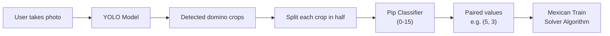
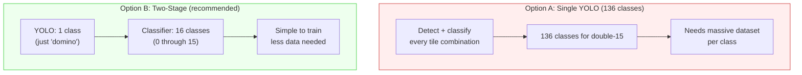
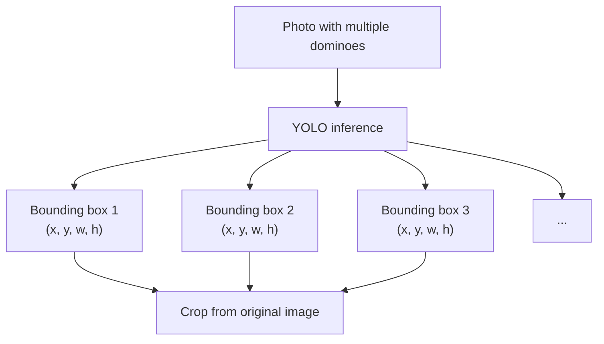
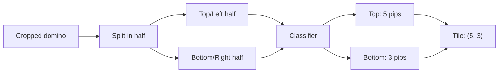
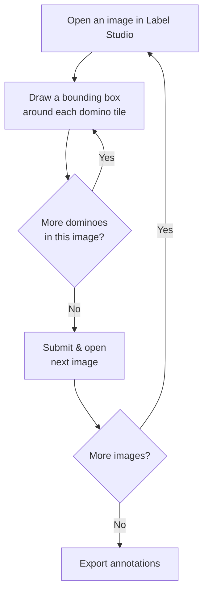
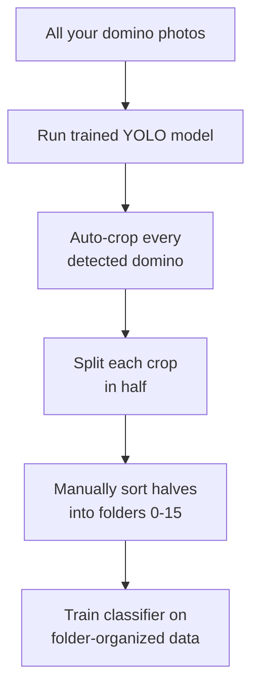
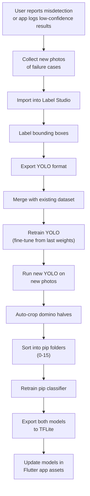
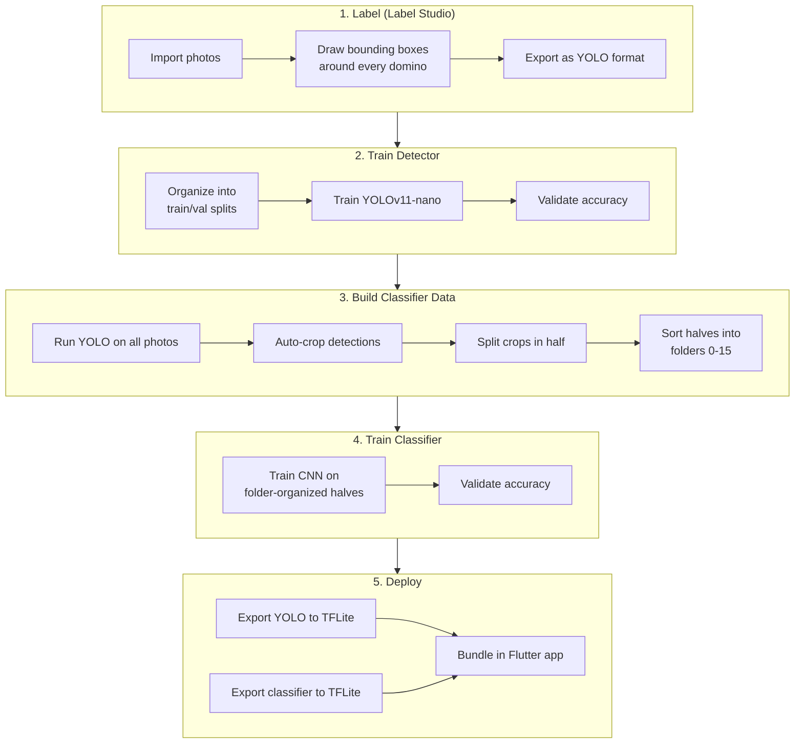

# ML Training Pipeline for Domino Detection

> Two-stage pipeline: YOLO detects whole domino tiles, then a classifier reads each half (0-15 pips).

---

## Table of Contents

1. [Pipeline Overview](#1-pipeline-overview)
2. [Stage 1: Domino Detection (YOLO)](#2-stage-1-domino-detection-yolo)
3. [Stage 2: Pip Classification (0-15)](#3-stage-2-pip-classification-0-15)
4. [Label Studio Setup](#4-label-studio-setup)
5. [Training the YOLO Model](#5-training-the-yolo-model)
6. [Training the Pip Classifier](#6-training-the-pip-classifier)
7. [Exporting for Mobile](#7-exporting-for-mobile)
8. [Retraining Workflow](#8-retraining-workflow)

---

## 1. Pipeline Overview

The app uses two models working together. YOLO finds every domino in the photo, then a lightweight classifier reads the pip count on each half.



### Why Two Models?



| Approach | Classes | Training Data Needed | Scalability |
|----------|---------|---------------------|-------------|
| Single model (whole tile) | 136 for double-15 | Enormous | Poor |
| Two-stage (detect + classify) | 1 + 16 = 17 total | Manageable | Trivial |

---

## 2. Stage 1: Domino Detection (YOLO)

YOLO's only job is to find rectangles that are dominoes. It doesn't care what's on them.

- **Classes**: 1 (`domino`)
- **Output**: Bounding box coordinates for every domino in the image
- **Model**: YOLOv11-nano



### What to photograph

Take photos of your double-15 set in varied conditions:

| Variation | Examples |
|-----------|----------|
| Arrangements | Tiles in hand, spread on table, in train formations |
| Lighting | Bright daylight, dim indoor, overhead, side-lit, shadows |
| Backgrounds | Wood table, felt, granite, carpet |
| Distances | Close-up (3-5 tiles), medium (10-15 tiles), wide (full board) |
| Angles | Straight down, slight tilt, perspective |

**Target**: 50-100 photos with 10-20 tiles each = 500-2000 labeled bounding boxes. The model learns "what a domino looks like" regardless of the pip values on it.

---

## 3. Stage 2: Pip Classification (0-15)

After YOLO detects a domino, the crop is split in half and each half is classified.

- **Classes**: 16 (`0`, `1`, `2`, ... `15`)
- **Input**: Cropped image of one half of a domino, resized to a fixed size (e.g. 100x100)
- **Output**: Pip count (0-15)



### Training data for the classifier

This data comes from your trained YOLO model — no manual labeling in Label Studio needed:

1. Run YOLO on all your photos to auto-crop every domino
2. Split each crop in half
3. Sort halves into folders by pip count

```
classifier_data/
  train/
    0/
      half_001.jpg
      half_002.jpg
    1/
      half_001.jpg
    ...
    15/
      half_001.jpg
  val/
    0/
    1/
    ...
    15/
```

---

## 4. Label Studio Setup

Label Studio is used **only for Stage 1** (YOLO domino detection). The classifier uses folder-based labeling.

### Installation

```bash
pip install label-studio
label-studio start
```

Opens at `http://localhost:8080`.

### Create a project

1. Click **Create Project**
2. Name it `Domino Detection`
3. Go to **Labeling Setup** > **Object Detection with Bounding Boxes**
4. Set up a single label: `domino`

### Labeling interface config

Use this XML config in **Settings > Labeling Interface > Code**:

```xml
<View>
  <Image name="image" value="$image"/>
  <RectangleLabels name="label" toName="image">
    <Label value="domino" background="green"/>
  </RectangleLabels>
</View>
```

### Import images

1. Go to your project
2. Click **Import**
3. Upload all your domino photos (JPG/PNG)

### Labeling workflow



### Labeling tips

- Draw boxes tightly around each domino tile (include the full tile, both halves)
- Include the dividing line within the box
- Don't worry about what's on the tile — every box is just labeled `domino`
- If tiles overlap, still draw separate boxes for each
- Label tiles even if they're partially cut off at the image edge

### Export annotations

1. Go to your project
2. Click **Export**
3. Select **YOLO** format
4. Download the zip file

This gives you:

```
export/
  images/
    img_001.jpg
    img_002.jpg
    ...
  labels/
    img_001.txt       # YOLO format: class x_center y_center width height
    img_002.txt
  classes.txt         # Contains: domino
  notes.json
```

Each `.txt` label file contains one line per domino:

```
0 0.45 0.32 0.12 0.08
0 0.71 0.55 0.11 0.09
```

Format: `class_id x_center y_center width height` (all normalized 0-1).

---

## 5. Training the YOLO Model

### Organize the dataset

After exporting from Label Studio, organize into YOLO training structure:

```
domino_dataset/
  train/
    images/
    labels/
  val/
    images/
    labels/
  data.yaml
```

Split roughly 80% train / 20% val.

### data.yaml

```yaml
path: ./domino_dataset
train: train/images
val: val/images

nc: 1
names: ['domino']
```

### Train with Ultralytics

```bash
pip install ultralytics

yolo detect train \
  model=yolo11n.pt \
  data=domino_dataset/data.yaml \
  epochs=100 \
  imgsz=640 \
  batch=16 \
  name=domino_detector
```

### Training output

```
runs/detect/domino_detector/
  weights/
    best.pt           # Best model checkpoint
    last.pt           # Last epoch checkpoint
  results.png         # Training metrics plots
  confusion_matrix.png
```

---

## 6. Training the Pip Classifier

### Generate training data from YOLO detections

Once your YOLO model can detect dominoes, use it to build the classifier dataset:



```python
from ultralytics import YOLO
from PIL import Image
import os

model = YOLO('runs/detect/domino_detector/weights/best.pt')
output_dir = 'classifier_data/unsorted'
os.makedirs(output_dir, exist_ok=True)

# Run detection on all photos
results = model.predict(source='all_photos/', save_crop=True)

# Each crop needs to be split in half and sorted manually
# The splitting can be automated:
for crop_path in os.listdir('runs/detect/predict/crops/domino/'):
    img = Image.open(f'runs/detect/predict/crops/domino/{crop_path}')
    w, h = img.size

    if h > w:
        # Vertical domino — split top/bottom
        top = img.crop((0, 0, w, h // 2))
        bottom = img.crop((0, h // 2, w, h))
    else:
        # Horizontal domino — split left/right
        left = img.crop((0, 0, w // 2, h))
        right = img.crop((w // 2, 0, w, h))

    # Save halves to unsorted folder for manual classification
    name = crop_path.replace('.jpg', '')
    top_or_left.save(f'{output_dir}/{name}_a.jpg')
    bottom_or_right.save(f'{output_dir}/{name}_b.jpg')
```

After splitting, manually sort the halves into folders `0/` through `15/`. This is tedious but only needs to be done once per batch.

### Train the classifier

A simple CNN or MobileNet fine-tune works well for 16 classes:

```python
import tensorflow as tf

IMG_SIZE = (100, 100)
BATCH_SIZE = 32

train_ds = tf.keras.utils.image_dataset_from_directory(
    'classifier_data/train',
    image_size=IMG_SIZE,
    batch_size=BATCH_SIZE
)

val_ds = tf.keras.utils.image_dataset_from_directory(
    'classifier_data/val',
    image_size=IMG_SIZE,
    batch_size=BATCH_SIZE
)

# Normalize pixel values
normalization = tf.keras.layers.Rescaling(1./255)
train_ds = train_ds.map(lambda x, y: (normalization(x), y))
val_ds = val_ds.map(lambda x, y: (normalization(x), y))

model = tf.keras.Sequential([
    tf.keras.layers.Conv2D(32, 3, activation='relu', input_shape=(100, 100, 3)),
    tf.keras.layers.MaxPooling2D(),
    tf.keras.layers.Conv2D(64, 3, activation='relu'),
    tf.keras.layers.MaxPooling2D(),
    tf.keras.layers.Conv2D(128, 3, activation='relu'),
    tf.keras.layers.MaxPooling2D(),
    tf.keras.layers.Flatten(),
    tf.keras.layers.Dropout(0.3),
    tf.keras.layers.Dense(128, activation='relu'),
    tf.keras.layers.Dense(16, activation='softmax')
])

model.compile(
    optimizer='adam',
    loss='sparse_categorical_crossentropy',
    metrics=['accuracy']
)

model.fit(train_ds, validation_data=val_ds, epochs=50)
model.save('pip_classifier.h5')
```

---

## 7. Exporting for Mobile

### YOLO to TFLite

```bash
yolo export model=runs/detect/domino_detector/weights/best.pt \
  format=tflite \
  int8=True \
  imgsz=640
```

### YOLO to CoreML (iOS)

```bash
yolo export model=runs/detect/domino_detector/weights/best.pt \
  format=coreml \
  nms=True
```

### Classifier to TFLite

```python
import tensorflow as tf

model = tf.keras.models.load_model('pip_classifier.h5')

converter = tf.lite.TFLiteConverter.from_keras_model(model)
converter.optimizations = [tf.lite.Optimize.DEFAULT]  # INT8 quantization
tflite_model = converter.convert()

with open('pip_classifier.tflite', 'wb') as f:
    f.write(tflite_model)
```

### Final assets for the Flutter app

```
assets/
  models/
    domino_detector.tflite    # YOLO — finds domino tiles (~3-4MB)
    pip_classifier.tflite     # Classifies pip count per half (~1MB)
    labels_detector.txt       # "domino"
    labels_classifier.txt     # "0\n1\n2\n...15"
```

---

## 8. Retraining Workflow

When the model isn't performing well on certain tiles or conditions, retrain with more data.



### Retraining YOLO (fine-tune from existing weights)

```bash
yolo detect train \
  model=runs/detect/domino_detector/weights/best.pt \
  data=domino_dataset_v2/data.yaml \
  epochs=50 \
  imgsz=640
```

### Merging datasets

When adding new labeled data, combine it with the original:

```bash
# Combine image and label directories
cp new_export/images/* domino_dataset/train/images/
cp new_export/labels/* domino_dataset/train/labels/

# Move ~20% of new data to val
# (keep original val intact for consistent benchmarking,
#  or reshuffle the entire dataset)
```

### Full end-to-end pipeline


