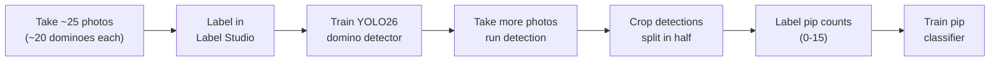
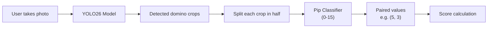
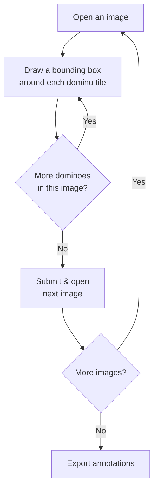
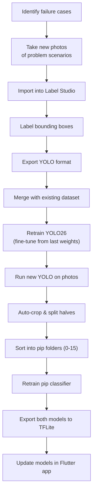

# Domino ML Pipeline

> Two models trained in sequence: **YOLO26** detects whole domino tiles, then a **classifier** reads the pip count on each half (0–15). All training runs in Google Colab notebooks.

---

## Table of Contents

1. [Pipeline Overview](#1-pipeline-overview)
2. [Phase 1: Photograph Dominoes](#2-phase-1-photograph-dominoes)
3. [Phase 2: Label with Label Studio](#3-phase-2-label-with-label-studio)
4. [Phase 3: Train Domino Detection (YOLO26)](#4-phase-3-train-domino-detection-yolo26)
5. [Phase 4: Build Pip Classification Dataset](#5-phase-4-build-pip-classification-dataset)
6. [Phase 5: Train Pip Classifier](#6-phase-5-train-pip-classifier)
7. [Exporting for Mobile](#7-exporting-for-mobile)
8. [Retraining Workflow](#8-retraining-workflow)

---

## 1. Pipeline Overview



### Why Two Models?

A single model would need to classify every possible tile combination — 136 classes for a double-15 set. By splitting into detection + classification, the problem becomes much simpler:

| Approach | Classes | Training Data Needed | Scalability |
|----------|---------|---------------------|-------------|
| Single model (whole tile) | 136 for double-15 | Enormous | Poor |
| Two-stage (detect + classify) | 1 + 16 = 17 total | Manageable | Trivial |

### End-to-End Flow (In-App)



---

## 2. Phase 1: Photograph Dominoes

Start with approximately **25 photos**, each containing around **20 dominoes** from your double-15 set. This gives ~500 domino instances to label.

### What to Capture

| Variation | Examples |
|-----------|----------|
| Arrangements | Spread on table, lined up, in train formations, in hand |
| Lighting | Bright daylight, dim indoor, overhead, side-lit, shadows |
| Backgrounds | Wood table, felt, granite, carpet |
| Distances | Close-up (3–5 tiles), medium (10–15 tiles), wide (full set) |
| Angles | Straight down, slight tilt, perspective |

### Tips

- Use your phone camera — the same device that will run the model
- Vary conditions across photos so the model generalizes well
- Don't worry about pip values — include a mix naturally
- Include some photos where tiles overlap or touch

---

## 3. Phase 2: Label with Label Studio

Label Studio is used **only for domino detection** (Stage 1). The pip classifier uses folder-based labeling later.

### Setup

```bash
pip install label-studio
label-studio start
# Opens at http://localhost:8080
```

### Create a Project

1. Click **Create Project**
2. Name it `Domino Detection`
3. Go to **Labeling Setup** > **Object Detection with Bounding Boxes**
4. Set up a single label: `domino`

### Labeling Interface Config

Use this XML config in **Settings > Labeling Interface > Code**:

```xml
<View>
  <Image name="image" value="$image"/>
  <RectangleLabels name="label" toName="image">
    <Label value="domino" background="green"/>
  </RectangleLabels>
</View>
```

### Import and Label

1. Go to your project and click **Import**
2. Upload all your domino photos
3. For each image, draw a tight bounding box around every domino tile



### Labeling Tips

- Draw boxes tightly around each domino tile (include both halves and the dividing line)
- Every box is just labeled `domino` — don't worry about what's on the tile
- If tiles overlap, still draw separate boxes for each
- Label tiles even if they're partially cut off at the image edge

### Export

1. Click **Export** in your project
2. Select **YOLO** format
3. Download the zip

This produces:

```
export/
  images/
    img_001.jpg
    img_002.jpg
  labels/
    img_001.txt    # YOLO format: class x_center y_center width height
    img_002.txt
  classes.txt      # Contains: domino
```

Each label file has one line per domino (all values normalized 0–1):

```
0 0.45 0.32 0.12 0.08
0 0.71 0.55 0.11 0.09
```

---

## 4. Phase 3: Train Domino Detection (YOLO26)

Training runs in a **Google Colab** notebook with GPU access.

### Organize the Dataset

After exporting from Label Studio, organize into the YOLO training structure:

```
domino_dataset/
  train/
    images/
    labels/
  val/
    images/
    labels/
  data.yaml
```

Split roughly **80% train / 20% val**.

### data.yaml

```yaml
path: ./domino_dataset
train: train/images
val: val/images

nc: 1
names: ['domino']
```

### Colab Training

```python
# Install Ultralytics
!pip install ultralytics

from ultralytics import YOLO

# Load YOLO26-nano pretrained model
model = YOLO('yolo26n.pt')

# Train on your domino dataset
results = model.train(
    data='domino_dataset/data.yaml',
    epochs=100,
    imgsz=640,
    batch=16,
    name='domino_detector'
)
```

### Training Output

```
runs/detect/domino_detector/
  weights/
    best.pt            # Best model checkpoint
    last.pt            # Last epoch checkpoint
  results.png          # Training metrics plots
  confusion_matrix.png
```

### Validate

```python
model = YOLO('runs/detect/domino_detector/weights/best.pt')
metrics = model.val()
```

---

## 5. Phase 4: Build Pip Classification Dataset

Once the YOLO26 model reliably detects dominoes, use it to generate training data for the pip classifier. Take **more photos** to increase variety, then run detection and crop.

### Auto-Crop and Split

```python
from ultralytics import YOLO
from PIL import Image
import os

model = YOLO('runs/detect/domino_detector/weights/best.pt')
output_dir = 'classifier_data/unsorted'
os.makedirs(output_dir, exist_ok=True)

# Run detection on all photos
results = model.predict(source='all_photos/', save_crop=True)

# Split each crop in half
for crop_path in os.listdir('runs/detect/predict/crops/domino/'):
    img = Image.open(f'runs/detect/predict/crops/domino/{crop_path}')
    w, h = img.size
    name = crop_path.replace('.jpg', '')

    if h > w:
        # Vertical domino — split top/bottom
        top = img.crop((0, 0, w, h // 2))
        bottom = img.crop((0, h // 2, w, h))
        top.save(f'{output_dir}/{name}_a.jpg')
        bottom.save(f'{output_dir}/{name}_b.jpg')
    else:
        # Horizontal domino — split left/right
        left = img.crop((0, 0, w // 2, h))
        right = img.crop((w // 2, 0, w, h))
        left.save(f'{output_dir}/{name}_a.jpg')
        right.save(f'{output_dir}/{name}_b.jpg')
```

### Label Pip Counts

Manually sort the halves from `unsorted/` into folders by pip count:

```
classifier_data/
  train/
    0/
      half_001.jpg
      half_002.jpg
    1/
      half_001.jpg
    ...
    15/
      half_001.jpg
  val/
    0/
    1/
    ...
    15/
```

This is tedious but only needs to be done once per batch. Split roughly 80/20 between train and val.

---

## 6. Phase 5: Train Pip Classifier

The model architecture for pip classification is TBD — we'll determine the best approach once we have the dataset built and can evaluate options. Training will run in **Google Colab**.

### Baseline Example (Simple CNN)

```python
import tensorflow as tf

IMG_SIZE = (100, 100)
BATCH_SIZE = 32

train_ds = tf.keras.utils.image_dataset_from_directory(
    'classifier_data/train',
    image_size=IMG_SIZE,
    batch_size=BATCH_SIZE
)

val_ds = tf.keras.utils.image_dataset_from_directory(
    'classifier_data/val',
    image_size=IMG_SIZE,
    batch_size=BATCH_SIZE
)

normalization = tf.keras.layers.Rescaling(1./255)
train_ds = train_ds.map(lambda x, y: (normalization(x), y))
val_ds = val_ds.map(lambda x, y: (normalization(x), y))

model = tf.keras.Sequential([
    tf.keras.layers.Conv2D(32, 3, activation='relu', input_shape=(100, 100, 3)),
    tf.keras.layers.MaxPooling2D(),
    tf.keras.layers.Conv2D(64, 3, activation='relu'),
    tf.keras.layers.MaxPooling2D(),
    tf.keras.layers.Conv2D(128, 3, activation='relu'),
    tf.keras.layers.MaxPooling2D(),
    tf.keras.layers.Flatten(),
    tf.keras.layers.Dropout(0.3),
    tf.keras.layers.Dense(128, activation='relu'),
    tf.keras.layers.Dense(16, activation='softmax')
])

model.compile(
    optimizer='adam',
    loss='sparse_categorical_crossentropy',
    metrics=['accuracy']
)

model.fit(train_ds, validation_data=val_ds, epochs=50)
model.save('pip_classifier.h5')
```

---

## 7. Exporting for Mobile

### YOLO26 to TFLite

```bash
yolo export model=runs/detect/domino_detector/weights/best.pt \
  format=tflite \
  int8=True \
  imgsz=640
```

### YOLO26 to CoreML (iOS)

```bash
yolo export model=runs/detect/domino_detector/weights/best.pt \
  format=coreml \
  nms=True
```

### Pip Classifier to TFLite

```python
import tensorflow as tf

model = tf.keras.models.load_model('pip_classifier.h5')

converter = tf.lite.TFLiteConverter.from_keras_model(model)
converter.optimizations = [tf.lite.Optimize.DEFAULT]
tflite_model = converter.convert()

with open('pip_classifier.tflite', 'wb') as f:
    f.write(tflite_model)
```

### Final App Assets

```
assets/
  models/
    domino_detector.tflite     # YOLO26 — finds domino tiles (~3-4MB)
    pip_classifier.tflite      # Classifies pip count per half (~1MB)
    labels_detector.txt        # "domino"
    labels_classifier.txt      # "0\n1\n2\n...15"
```

---

## 8. Retraining Workflow

When the model struggles with certain tiles or conditions:



### Fine-Tune YOLO26

```python
model = YOLO('runs/detect/domino_detector/weights/best.pt')
model.train(
    data='domino_dataset_v2/data.yaml',
    epochs=50,
    imgsz=640
)
```

### Merging Datasets

```bash
# Add new labeled data to existing dataset
cp new_export/images/* domino_dataset/train/images/
cp new_export/labels/* domino_dataset/train/labels/

# Move ~20% of new data to val
```
